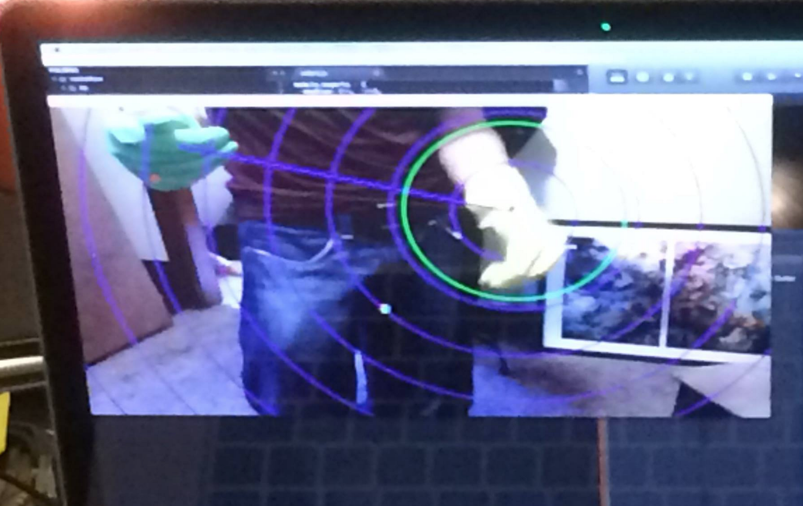

# Air Guitar Hero
## Cleveland Rockathon 2014

Using node.js and some primitive color detection and tracking I wrote an app to generate MIDI messages based upon guitar and drum like movements (if you're wearing rubber gloves)

